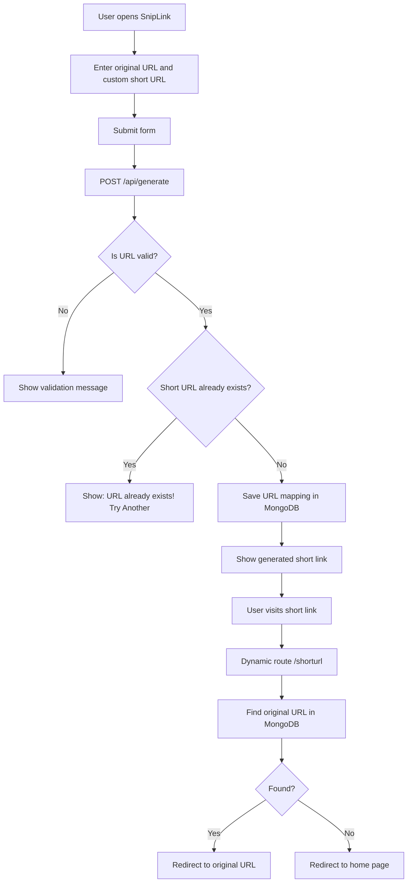
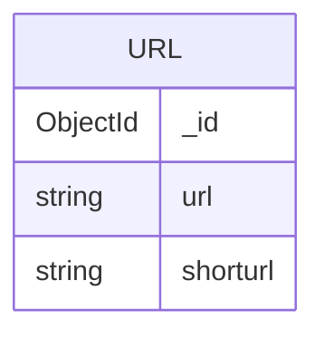
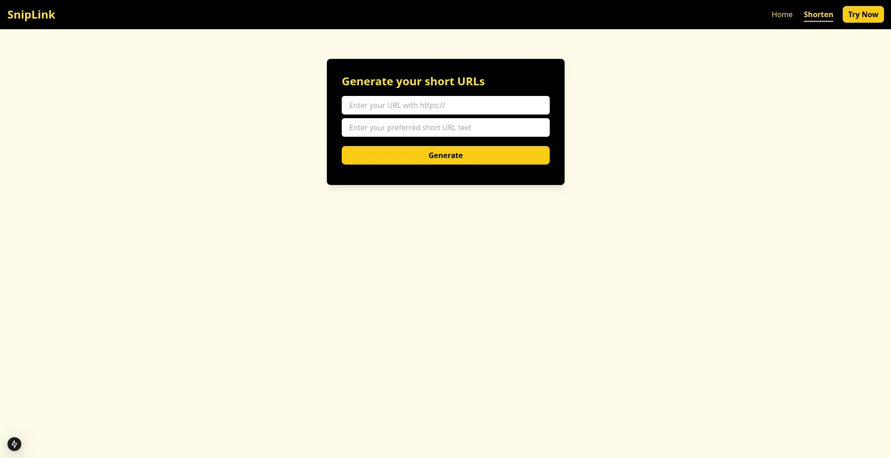
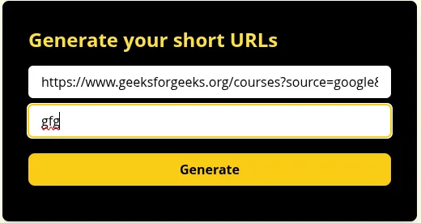

# 🔗 SnipLink - URL shortener

SnipLink is a simple URL shortener built with Next.js and MongoDB. It lets users create custom short links and redirect visitors to the original URLs. ⚡

## 🌐 Live Demo

https://sniplink.debarghya.org

## 💡 Motivation

SnipLink was built to provide a clean, fast, and straightforward way to shorten URLs without unnecessary login steps or tracking-heavy flows.

## ✨ Features

- Create custom short URLs
- Redirect short links to the original URL
- Duplicate short URL protection
- MongoDB-powered link storage
- Responsive yellow-and-black UI
- Simple validation and user-friendly messages

## 🧰 Tech Stack

- **Frontend:** Next.js, React
- **Backend:** Next.js API Routes
- **Database:** MongoDB
- **Styling:** Tailwind CSS
- **Deployment:** Vercel / Node.js hosting
- **Tools:** ESLint, Postman

## 🏗️ Architecture

### 1. 3-Tier Client–Server Architecture

```text
┌──────────────────────────────┐
│          Client Tier          │
│  Browser / User Interface     │
│  Home Page + Shorten Form     │
└───────────────┬──────────────┘
                │ HTTP Request
                ▼
┌──────────────────────────────┐
│       Application Tier        │
│  Next.js App Router           │
│  API Route: /api/generate     │
│  Dynamic Route: /[shorturl]   │
└───────────────┬──────────────┘
                │ MongoDB Query
                ▼
┌──────────────────────────────┐
│          Data Tier            │
│  MongoDB Database             │
│  Stores original URL + slug   │
└──────────────────────────────┘
```

### 2. System Architecture & Workflow Diagram



## 📁 Folder Structure

```text
sniplink/
├── app/
│   ├── [shorturl]/
│   │   └── page.js              # Redirects short URLs to original URLs
│   ├── api/
│   │   └── generate/
│   │       └── route.js         # API route for creating short links
│   ├── fonts/                   # Local font files
│   ├── shorten/
│   │   └── page.js              # Short URL generator page
│   ├── globals.css              # Global Tailwind styles
│   ├── layout.js                # Root layout and metadata
│   └── page.js                  # Home page
├── components/
│   └── Navbar.js                # Main navigation bar
├── lib/
│   └── mongodb.js               # MongoDB connection helper
├── public/
│   ├── vector.webp              # Homepage illustration
│   ├── web-tab-logo.webp        # Browser tab icon
│   └── *.webp                   # Project images/screenshots
├── SnipLink.postman_collection.json
├── package.json
├── tailwind.config.js
├── next.config.mjs
└── README.md
```

## 🗄️ Database Design

### 1. Database Schema / Entity Relationship Diagram (ERD)

SnipLink uses MongoDB to store URL mappings in a single collection.

```text
Database: sniplink
Collection: url

Document Structure:
{
  _id: ObjectId,
  url: String,
  shorturl: String
}
```



- `_id`: Unique MongoDB document ID
- `url`: Original long URL entered by the user
- `shorturl`: Custom short URL slug used for redirection

## 📸 Screenshots

### Home Page


### Shorten Page



### URL Input



### Success Notification


### Generated Short Link


### Duplicate URL Message


## ⚙️ Installation

1. Clone the repository:

```bash
git clone <repository-url>
cd sniplink
```

2. Install dependencies:

```bash
npm install
```

3. Add environment variables in `.env.local`.

4. Run the development server:

```bash
npm run dev
```

5. Open the app:

```text
http://localhost:3000
```

## 🔐 Environment Variables

Create a `.env.local` file in the project root and add:

```env
MONGODB_URI=your_mongodb_connection_string
NEXT_PUBLIC_HOST=http://localhost:3000
```

For deployment, update `NEXT_PUBLIC_HOST` to your live domain:

```env
NEXT_PUBLIC_HOST=https://sniplink.debarghya.org
```

## 🧩 Challenges Faced

- Handling duplicate custom short URLs without breaking the user experience
- Validating user input before saving URLs to the database
- Managing MongoDB connection safely in a Next.js App Router project
- Keeping the UI responsive across mobile, tablet, and laptop screens
- Optimizing public images for faster loading
- Preparing the project for deployment with clean dependencies and ignored secrets

## ✅ Solutions Implemented

- Added duplicate short URL checks before inserting data into MongoDB
- Added URL and slug validation with clear user-facing messages
- Created a reusable MongoDB connection helper in `lib/mongodb.js`
- Improved responsive layout using Tailwind CSS utility classes
- Converted public images to optimized WebP assets
- Added `.gitignore` rules for `.env.local`, `.next/`, and `node_modules/`
- Updated dependencies and verified the project with lint, build, audit, and production smoke tests

## 🧪 Testing

The project was tested with:

- ESLint checks using `npm run lint`
- Production build verification using `npm run build`
- Production server smoke testing using `npm run start`
- API validation testing for invalid URLs
- MongoDB insert testing for new short URLs
- Duplicate short URL testing
- Redirect testing from short URL to original URL

## 🚀 Optimization

- Converted public images from PNG/JPG to WebP
- Removed unused image duplicates safely
- Used Next.js image optimization through `next/image`
- Added responsive layouts for mobile, tablet, and laptop screens
- Kept generated links break-safe to prevent mobile overflow
- Cleaned stale `.next` cache during final build checks

## 🔒 Security

- Environment variables are stored in `.env.local`
- `.env.local` is ignored by Git
- MongoDB URI is not committed to the repository
- User input is validated before database insertion
- Duplicate short URL slugs are blocked
- Only `http://` and `https://` URLs are allowed
- Dependencies were updated and verified with `npm audit --omit=dev`

## 🔮 Future Improvements

- Add click analytics for each short URL
- Add QR code generation for shortened links
- Add user authentication and personal dashboards
- Add automatic random short URL generation
- Add link expiration support
- Add copy-to-clipboard functionality
- Add custom domain support

## 📚 Learnings

- Built a full-stack URL shortener using Next.js App Router
- Learned how to connect MongoDB with a Next.js application
- Practiced API route validation and error handling
- Improved responsive UI design with Tailwind CSS
- Learned how to optimize images using WebP
- Practiced deployment-readiness checks like linting, building, auditing, and smoke testing

## 👤 Author Details

### 🤝 Be My Friend

I always like to make new friends. Follow me on:

[](https://www.linkedin.com/in/debarghya-bandyopadhyay-953b02400?utm_source=share_via&utm_content=profile&utm_medium=member_android)

[](https://x.com/debarghya131)

[](https://github.com/debarghya131)

[](https://portfolio.debarghya.org)

[](mailto:debarghyabandyopadhyay191@gmail.com)
